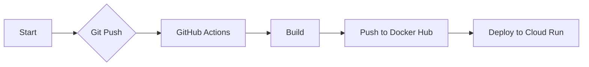

# project
Teanble-test

# production:
Front end: https://teanble-test.vercel.app/
back end: https://teanble-test.herokuapp.com/

- all CI/CD related files are in .github/workflows
- all docker related files are in docker

This diagram represents the following steps:

Start: The process begins.
Git Push: You push your changes to your GitHub repository.
GitHub Actions: GitHub Actions detects the push and starts the CI/CD pipeline.
Build: GitHub Actions builds the Docker image.
Push to Docker Hub: GitHub Actions pushes the Docker image to Docker Hub.
Deploy to Cloud Run: GitHub Actions deploys the Docker image to Cloud Run.

